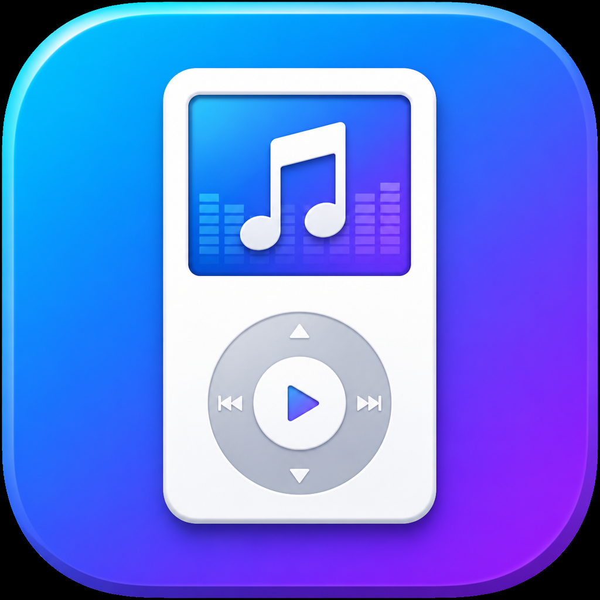

# Ulti-Sound Music Player for Nintendo 3DS

An iPod-inspired media player for the Nintendo 3DS homebrew scene. It browses
the media on your SD card **by folder** and plays the common audio formats used
in the community — **WAV, MP3, FLAC, OGG Vorbis and AAC** — plus **MJPEG video**,
with a clean two-screen interface: a "Now Playing" / video view on the top screen
and a classic iPod-style menu on the bottom touch screen. A bottom tab bar splits
it into **Music**, **Movies** and **Settings**. It also has a **song search**
across your whole card, a **Cover Flow** album browser, a **5-band graphic EQ**,
a **dark mode**, an adjustable **pre-amp**, and lets you **set custom album art
per folder** (from any image on the SD card).

<p align="center">
  
</p>

## Features

- **Three tabs on the bottom screen** — **Music**, **Movies** and **Settings** —
  tap to switch.
- **Folder-based library browsing** straight off the SD card (`sdmc:/`).
- **Multi-format playback** via self-contained decoders (no external codecs to install):
  - WAV / PCM (`dr_wav`)
  - MP3 (`dr_mp3`)
  - FLAC (`dr_flac`)
  - OGG Vorbis (`stb_vorbis`)
  - AAC — raw `.aac` (ADTS) and `.m4a` / `.mp4` / `.m4b` (`faad2` + `minimp4`),
    including HE-AAC (SBR/PS)
- **Song search** — tap the magnifier in the list header, type on the 3DS software
  keyboard, and Ulti-Sound scans your whole SD card for matching songs. Results
  become the play queue, so next/previous move through your search hits.
- **Custom album art, applied to a whole folder at once** — drop an image
  (`png` / `jpg` / `bmp`) into a music folder, highlight it in the browser and press
  `A`. That image becomes the cover for **every** track in the folder (stored in a
  tiny `_ultisound_cover.txt` sidecar). Common names like `cover.jpg` / `folder.jpg`
  are also picked up automatically.
- **iPod-style UI** drawn with citro2d: now-playing screen with the folder's album
  art, progress scrubber, elapsed/remaining time, format + sample-rate readout, and
  a classic blue-gradient selection list on the touch screen.
- **Streaming audio engine** on NDSP with a background decode thread, so the UI
  stays responsive. Any sample rate is resampled by the DSP; mono and multi-channel
  sources are folded to stereo automatically.
- **Playback controls**: play/pause, previous/next, seek, shuffle, repeat, volume,
  gapless auto-advance to the next track in the folder.
- **Movies (MJPEG video), iPod-video style** — the Movies tab browses videos and
  plays them full-screen on the top screen with **synchronized audio** and **on-screen
  touch controls** (play/pause, stop, and a tap-to-seek scrubber on the bottom screen).
  Supported containers: **`.avi`** and **`.mp4` / `.mov` / `.m4v`**. The 3DS can't
  software-decode H.264/HEVC at usable quality, so the *video track must be
  Motion-JPEG* (every frame is a JPEG); AVI audio is 16-bit PCM and MP4/MOV audio is
  decoded through the built-in AAC decoder. If you open a normal H.264 `.mp4`, it
  detects that and tells you to convert. One FFmpeg command does it:

  ```bash
  # AVI (PCM audio):
  ffmpeg -i input.mp4 -vf scale=400:-2 -c:v mjpeg -q:v 5 -c:a pcm_s16le output.avi
  # or MP4 (MJPEG video + AAC audio):
  ffmpeg -i input.mp4 -vf scale=400:-2 -c:v mjpeg -q:v 5 -c:a aac output.mp4
  ```

  (`-q:v` 2–7 trades quality for size.)
- **Cover Flow album browser** — tap the Cover Flow button in the Music header to
  flip through your folders as an iPod-style carousel of album covers (with floor
  reflections and a big centered cover). Flick with D-Pad/Circle Pad Left/Right or the
  on-screen arrows, then **Open** the centered album to play it (or drill into its
  subfolders). Press `B` to step back out.
- **Audio enhancement (DSP) — beginner *and* audiophile friendly.** A real-time
  processing suite runs on the decoded PCM:
  - One-tap **presets**: Off, Bass Boost, Treble, Vocal Clarity, **Virtual Surround**,
    Loudness, Rock.
  - A proper **5-band graphic equalizer** (60 Hz / 230 Hz / 910 Hz / 3.6 kHz / 14 kHz,
    each ±12 dB, RBJ peaking filters) with a dedicated editor — vertical sliders you
    drag or nudge with the D-Pad. Any manual change switches to the "Custom" preset.
  - **Stereo width** (0–100, mid/side widening for a surround-like feel).
  - *Note on "Dolby":* Dolby is proprietary/trademarked and can't be legally bundled
    into open homebrew, so these are original DSP effects that provide the same kinds
    of improvements (surround feel, bass, loudness) without any licensed code.
- **Adjustable visualizers** (top screen, music) — cycle with the **Circle Pad
  left/right** or pick in Settings:
  - **Default** — album art + track info + scrubber.
  - **Soundwaves** — a live oscilloscope driven by the audio.
  - **Spectrum** — real-time FFT frequency bars with peak-hold caps.
- **Dark mode** — a full dark theme for both screens, toggled in Settings and
  remembered across launches.
- **Settings tab**:
  - **Theme** — Light or Dark.
  - **Pre-amp gain 0–300%** — boost quiet tracks (values above 100% amplify and
    can clip).
  - **Sound enhancement** (presets), **Equalizer** (opens the 5-band editor),
    **Stereo width**, **Visualizer** — see above.
  - **Set album cover from any SD image** — pick any image on the card and apply it
    as the cover for the now-playing folder (stored as an absolute path in the
    folder's `_ultisound_cover.txt` sidecar).
  - All settings are saved to `sdmc:/3ds/ulti-sound/settings.cfg` and restored on launch.

## Install (on your 3DS)

1. Copy **`ulti-sound-3ds.3dsx`** to your SD card, ideally under `/3ds/`
   (e.g. `sd:/3ds/ulti-sound-3ds/ulti-sound-3ds.3dsx`).
2. Put your music anywhere on the SD card, organized in folders.
3. Launch the **Homebrew Launcher** and open **Ulti-Sound Music Player**.

> **Sound requires the DSP firmware.** Like all NDSP-based homebrew, audio needs
> the console's DSP firmware to have been dumped once (file `sdmc:/3ds/dspfirm.cdc`).
> If you have no sound, run the **DSP1** dumper homebrew once, then relaunch.

## Controls

Tap the **Music / Movies / Settings** tabs at the bottom of the touch screen to
switch modes. Most controls depend on the current tab:

| Input | Action |
|-------|--------|
| Touch tab bar | Switch between Music / Movies / Settings |
| D-Pad Up / Down | Move selection in the current list |
| A | Open folder / play song / **play video** / activate setting |
| B | Go up one folder / leave search / **stop video** / close picker |
| Touch | Tap a row to open it |
| X | Play / Pause (music, or the current video) |
| START | Quit |

**Music tab**

| Input | Action |
|-------|--------|
| L + R (together) | Open song search |
| Touch (list header magnifier) | Open song search |
| Touch (list header Cover Flow icon) | Open the Cover Flow album browser |
| L / R | Previous / Next track |
| D-Pad Left / Right | Seek −5s / +5s |
| Circle Pad Up / Down | Volume down / up |
| Y | Toggle shuffle |
| SELECT | Toggle repeat |

**Movies tab** — `A` plays the selected video. During playback: `X` (or the on-screen
button) pauses, `B`/`Y` (or Stop/List) returns to the list, D-Pad Left/Right seeks
±10 s, and you can **tap the scrubber** on the bottom screen to seek anywhere.

**Settings tab** — D-Pad Up/Down moves between rows; Left/Right adjusts the selected
row (theme, pre-amp, sound enhancement, stereo width, visualizer). `A` toggles/cycles
the choice rows, opens the **Equalizer** editor, or opens the **cover picker**. You
can also tap the left/right side of a row on the touch screen.

**Equalizer editor** — D-Pad Left/Right selects a band, Up/Down changes its gain
(±12 dB), `L`/`R` step through presets, and you can drag the sliders directly on the
touch screen. `B` (or the footer) closes it.

**Cover Flow** — from the Music tab, tap the Cover Flow icon in the top-left of the
list header. Flip albums with D-Pad/Circle Pad Left/Right or the on-screen arrows,
press `A` / **Open** to play the centered album (or drill into its subfolders), and
`B` to go back.

**Visualizers** — while music plays, flick the **Circle Pad left/right** to switch
between Default, Soundwaves and Spectrum (also selectable in Settings).

Selecting a song builds the play queue from **all audio files in that folder**, so
tracks auto-advance within the folder. `L` at more than ~3s into a track restarts
it (iPod behavior); press `L` again quickly to jump to the previous track.

**Searching:** press **L + R together** (or tap the magnifier in the top-right of the
list header), type a query, and confirm. Matching songs from anywhere on the card are
listed; press `A` (or tap) to play — the results become the queue. Press `B` to return
to folder browsing.

**Setting album art:** either put an image file in a folder of songs, browse to it,
and press `A` while it's highlighted; or, in **Settings → Set album cover from SD
image**, pick any image anywhere on the card to apply to the now-playing folder.
Either way it's saved as that folder's cover and shown on the Now Playing screen
for every track in the folder.

**Watching a movie:** convert your video to MJPEG AVI (see Features), drop it on
the SD card, open the **Movies** tab, and press `A`. The video plays full-screen on
the top screen with synced audio; `X` pauses, `B` stops.

## Building it yourself

The project builds with the standard **devkitPro / devkitARM** toolchain and
libctru + citro2d/citro3d. The audio decoders are vendored as header-only
libraries in `include/` and `source/`, so there are no extra dependencies.

### Option A — devkitPro installed locally

```bash
make            # produces ulti-sound-3ds.3dsx and .smdh
make clean
```

### Option B — Docker (what this repo was built with)

If the devkitPro package servers are unreachable, the official Docker image works
and pulls from Docker Hub:

```bash
docker run --rm -v "$PWD":/project -w /project devkitpro/devkitarm:latest make
```

On Windows this repo drives Docker Engine from inside WSL. The helper scripts in
`scripts/` automate it:

- `scripts/setup_docker.sh` — installs Docker Engine in WSL, starts the daemon,
  and pulls `devkitpro/devkitarm`.
- `scripts/build.sh [target]` — compiles the project in the container
  (`build.sh` for `all`, `build.sh clean` to clean).
- `scripts/make_icon.sh` — regenerates the 48×48 SMDH icon from `assets/`.

Run them with:

```powershell
wsl -d Ubuntu-20.04 -u root -- bash /mnt/c/Users/<you>/Projects/ulti-sound-3ds/scripts/setup_docker.sh
wsl -d Ubuntu-20.04 -u root -- bash /mnt/c/Users/<you>/Projects/ulti-sound-3ds/scripts/build.sh
```

## Project layout

```
Makefile              devkitPro 3DS app makefile (SMDH metadata + citro2d/3d libs)
include/              vendored libs: dr_wav/dr_mp3/dr_flac, stb_image, minimp4,
                      neaacdec.h (faad2 API) + decoder.h / aac.h / art.h
source/
  main.c              app loop, input routing, tabs, play queue, search, settings
  ui.c / ui.h         citro2d rendering (tabs, browsers, settings, visualizers, video)
  audio.c / audio.h   NDSP engine + decode thread + pre-amp + DSP effects + viz tap
  video.c / video.h   MJPEG player: AVI + MP4/MOV demux, JPEG->texture, synced audio
  covers.c / covers.h LRU cache of folder covers for the Cover Flow browser
  usdec.c             unified decoder (WAV/MP3/FLAC/OGG/AAC -> stereo s16)
  aac.c / aac.h       AAC front-end (faad2 + minimp4 demux for .m4a/.mp4)
  art.c / art.h       per-folder album art: decode + GPU texture upload
  library.c           SD-card folder browsing, sorting, audio/video/image filters
  stb_vorbis.c        vendored OGG Vorbis decoder (compiled TU)
  dr_impl.c           dr_libs implementation translation unit
  img_impl.c          stb_image implementation translation unit
  faad/               vendored faad2 AAC decoder sources
scripts/              WSL/Docker build helpers
assets/               source artwork for the icon
```

## Credits

- [devkitPro](https://devkitpro.org/) — devkitARM, libctru, citro2d/citro3d.
- [mackron/dr_libs](https://github.com/mackron/dr_libs) — dr_wav, dr_mp3, dr_flac.
- [nothings/stb](https://github.com/nothings/stb) — stb_vorbis, stb_image.
- [lieff/minimp4](https://github.com/lieff/minimp4) — MP4/M4A demuxing.
- [knik0/faad2](https://github.com/knik0/faad2) — AAC decoding.

## Licensing note

The core player and most vendored libraries are public-domain/permissive, but
**faad2 (the AAC decoder) is licensed under the GPLv2**. Because it is compiled in,
distributed binaries of Ulti-Sound are covered by the GPLv2. Code from FAAD2 is
copyright © Nero AG, www.nero.com.
