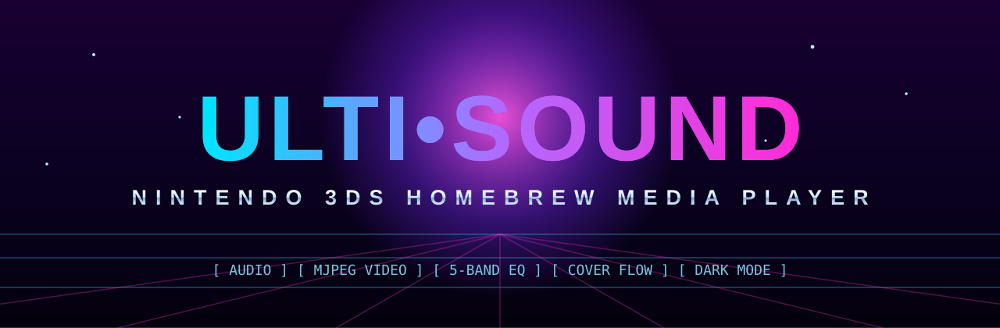

<!-- ░▒▓ ULTI-SOUND ▓▒░ -->
<p align="center">
  
</p>

<p align="center">
  
  
  
  
  <a href="https://github.com/kiingniick/ulti-sound-3ds/releases/latest"></a>
</p>

<p align="center">
  <b>An iPod-inspired media player for the Nintendo&nbsp;3DS homebrew scene.</b><br>
  <sub>Browses your SD card <b>by folder</b> · plays the formats the scene actually uses · one <code>.3dsx</code>, zero installers.</sub>
</p>

<p align="center">
  <a href="#-quick-start">Quick Start</a> ·
  <a href="#-features">Features</a> ·
  <a href="#-controls">Controls</a> ·
  <a href="#-build-from-source">Build</a> ·
  <a href="#-troubleshooting">Troubleshooting</a> ·
  <a href="#-credits">Credits</a>
</p>

---

## ⟢ Quick Start

> [!TIP]
> **Just want to use it?** Grab the latest [`ulti-sound-3ds.3dsx`](https://github.com/kiingniick/ulti-sound-3ds/releases/latest) — that single file *is* the app.

1. **Download** [`ulti-sound-3ds.3dsx`](https://github.com/kiingniick/ulti-sound-3ds/releases/latest) from Releases.
2. **Copy** it to your SD card, ideally under `sd:/3ds/ulti-sound-3ds/`.
3. **Add media** — drop your music and videos anywhere on the card, organized in folders.
4. **Launch** the **Homebrew Launcher** (Luma3DS / your CFW) and open **Ulti-Sound Music Player**.

> [!IMPORTANT]
> **No sound?** Like all NDSP homebrew, audio needs the console's DSP firmware dumped once to
> `sdmc:/3ds/dspfirm.cdc`. Run the **DSP1** dumper homebrew a single time, then relaunch Ulti-Sound.

---

## ◆ Features

### 🎧 Plays what the scene throws at it
| Audio | Video |
|-------|-------|
| WAV / PCM · MP3 · FLAC · OGG Vorbis | **MJPEG** in `.avi` and `.mp4` / `.mov` / `.m4v` |
| AAC — raw `.aac` (ADTS) and `.m4a` / `.mp4` / `.m4b`, incl. **HE-AAC** (SBR/PS) | Synced audio (PCM for AVI, AAC for MP4/MOV) |

All decoders are **vendored** (header-only libs + faad2 in-tree) — nothing extra to install.

### 📀 A real iPod-style interface
- **Music / Movies / Settings** tabs on the bottom touch screen, with a redesigned tab bar.
- **Cover Flow** album browser — flip through folders as a carousel of album covers with floor reflections, straight off the reference iPod look.
- **Now Playing** with per-folder album art, a scrubber, elapsed/remaining time, and format + sample-rate readout.

### 🎚️ Beginner *and* audiophile friendly DSP
- One-tap **presets**: Off, Bass Boost, Treble, Vocal Clarity, Virtual Surround, Loudness, Rock.
- A proper **5-band graphic EQ** (60 Hz · 230 Hz · 910 Hz · 3.6 kHz · 14 kHz, ±12 dB, RBJ peaking filters) with a full slider **editor**.
- **Stereo width** (mid/side) and a **pre-amp** (0–300%) for quiet rips.

### 🌈 Visualizers & vibes
- **Default** (art + info), **Soundwaves** (oscilloscope), and an FFT **Spectrum** analyzer with peak-hold caps.
- **Dark mode** for both screens, remembered across launches.

### 🔎 Get around fast
- **Song search** across the *entire* SD card (software keyboard) — results become the play queue.
- **Custom album art per folder** — highlight an image in a folder and press `A`, or pick any image on the card in Settings.
- All preferences saved to `sdmc:/3ds/ulti-sound/settings.cfg`.

---

## 🎮 Controls

Tap the **Music / Movies / Settings** tabs at the bottom to switch modes.

| Global | Action |
|--------|--------|
| Touch tab bar | Switch Music / Movies / Settings |
| D-Pad ▲ / ▼ | Move selection |
| `A` | Open folder · play song · play video · activate setting |
| `B` | Up a folder · leave search · stop video · close overlay |
| `X` | Play / Pause |
| `START` | Quit |

<details>
<summary><b>🎵 Music tab</b></summary>

| Input | Action |
|-------|--------|
| `L` + `R` together, or the magnifier | Open song search |
| Cover Flow icon (top-left of header) | Open the Cover Flow album browser |
| `L` / `R` | Previous / Next track |
| D-Pad ◄ / ► | Seek −5s / +5s |
| Circle Pad ▲ / ▼ | Volume down / up |
| Circle Pad ◄ / ► | Cycle visualizer (Default · Soundwaves · Spectrum) |
| `Y` | Toggle shuffle |
| `SELECT` | Toggle repeat |

Selecting a song queues **every audio file in that folder**, so tracks auto-advance. `L` past ~3s restarts the track; press it again quickly to jump back.
</details>

<details>
<summary><b>🎬 Movies tab</b></summary>

`A` plays the selected video full-screen. During playback: `X` (or the on-screen button) pauses, `B`/`Y` (or Stop/List) returns, D-Pad ◄/► seeks ±10s, and you can **tap the scrubber** to seek anywhere.
</details>

<details>
<summary><b>⚙️ Settings tab</b></summary>

D-Pad ▲/▼ moves between rows; ◄/► adjusts the selected row (theme, pre-amp, sound enhancement, stereo width, visualizer). `A` toggles/cycles choices, opens the **Equalizer** editor, or opens the **cover picker**. You can also tap the left/right side of a row.

**Equalizer editor:** D-Pad ◄/► selects a band, ▲/▼ changes gain, `L`/`R` step presets, or drag the sliders. `B` closes.

**Cover Flow:** flip with D-Pad/Circle Pad ◄/► or the on-screen arrows, `A`/**Open** plays the centered album (or drills into subfolders), `B` goes back.
</details>

---

## 🛠️ Build from Source

This is a **CMake** project targeting the **devkitPro / devkitARM** toolchain (libctru + citro2d/citro3d). All decoders are vendored in-tree, so there are no dependencies to fetch.

### ▸ Option A — CMake + devkitPro (recommended)

Install devkitPro with the **`3ds-dev`** group so `$DEVKITPRO` is set, then:

```bash
cmake --preset 3ds          # configures with $DEVKITPRO/cmake/3DS.cmake (Ninja)
cmake --build --preset 3ds  # → build/ulti-sound-3ds.3dsx (also copied to repo root)
```

No presets? The plain form works too:

```bash
cmake -S . -B build -G Ninja -DCMAKE_TOOLCHAIN_FILE="$DEVKITPRO/cmake/3DS.cmake"
cmake --build build -j
```

### ▸ Option B — CMake inside Docker (what this repo is built with)

No local toolchain required — the official image ships everything:

```bash
docker run --rm -v "$PWD":/project -w /project devkitpro/devkitarm:latest \
  bash -lc 'cmake -S . -B build -G Ninja -DCMAKE_TOOLCHAIN_FILE="$DEVKITPRO/cmake/3DS.cmake" && cmake --build build -j'
```

On Windows this drives Docker Engine from WSL. Helper scripts in `scripts/`:

- `scripts/setup_docker.sh` — install Docker in WSL + pull the toolchain image.
- `scripts/build.sh` — configure + build in the container (`build.sh clean` wipes `build/`).

```powershell
wsl -d Ubuntu-20.04 -u root -- bash /mnt/c/Users/<you>/Projects/ulti-sound-3ds/scripts/build.sh
```

> A classic `Makefile` is also kept for the traditional `make` flow, but **CMake is the primary, supported build**.

---

## 🎞️ Converting video for the 3DS

The 3DS can't software-decode H.264/HEVC at usable speed, so the **video track must be Motion-JPEG**. One FFmpeg command:

```bash
# AVI (PCM audio):
ffmpeg -i input.mp4 -vf scale=400:-2 -c:v mjpeg -q:v 5 -c:a pcm_s16le output.avi
# or MP4 (MJPEG video + AAC audio):
ffmpeg -i input.mp4 -vf scale=400:-2 -c:v mjpeg -q:v 5 -c:a aac output.mp4
```

`-q:v` 2–7 trades quality for size. Open a normal H.264 file and Ulti-Sound will detect it and point you here.

---

## 🧭 Troubleshooting

| Symptom | Fix |
|---------|-----|
| **No audio at all** | Dump DSP firmware once (DSP1 → `sdmc:/3ds/dspfirm.cdc`), relaunch. |
| **Video won't play / says convert** | Re-encode the video track to MJPEG (see above). |
| **App not in Homebrew Launcher** | Ensure the `.3dsx` is on the SD card (e.g. `sd:/3ds/…`) and you booted HBL. |
| **No cover art** | Add `cover.jpg`/`folder.jpg` to the folder, or set one in-app (`A` on an image, or Settings → cover picker). |

---

## 🗂️ Project Layout

```
CMakeLists.txt        CMake build (primary) — compiles, packages .smdh + .3dsx
CMakePresets.json     "3ds" configure/build presets (devkitPro toolchain)
Makefile              legacy devkitPro make build (kept as an alternative)
include/              vendored libs: dr_wav/dr_mp3/dr_flac, stb_image, minimp4, neaacdec.h
source/
  main.c              app loop, input routing, tabs, play queue, search, settings
  ui.c / ui.h         citro2d rendering (tabs, browsers, EQ, visualizers, Cover Flow, video)
  audio.c / audio.h   NDSP engine + decode thread + pre-amp + 5-band EQ + viz tap
  video.c / video.h   MJPEG player: AVI + MP4/MOV demux, JPEG→texture, synced audio
  covers.c / covers.h LRU cache of folder covers for the Cover Flow browser
  usdec.c             unified decoder (WAV/MP3/FLAC/OGG/AAC → stereo s16)
  aac.c / aac.h       AAC front-end (faad2 + minimp4 demux)
  art.c / art.h       per-folder album art: decode + GPU texture upload
  library.c           SD-card folder browsing + audio/video/image filters
  faad/               vendored faad2 AAC decoder sources
scripts/              WSL/Docker build helpers
assets/               banner + source artwork
```

---

## ✨ Credits

- [devkitPro](https://devkitpro.org/) — devkitARM, libctru, citro2d/citro3d, CMake toolchain.
- [mackron/dr_libs](https://github.com/mackron/dr_libs) — dr_wav, dr_mp3, dr_flac.
- [nothings/stb](https://github.com/nothings/stb) — stb_vorbis, stb_image.
- [lieff/minimp4](https://github.com/lieff/minimp4) — MP4/M4A demuxing.
- [knik0/faad2](https://github.com/knik0/faad2) — AAC decoding.

## 📜 License

The core player and most vendored libraries are public-domain/permissive, but
**faad2 (the AAC decoder) is GPLv2** — because it is compiled in, distributed binaries
of Ulti-Sound are covered by the **GPLv2**. AAC decoding code © Nero AG, www.nero.com.

<p align="center"><sub>▚▚▚ made for the 3DS homebrew scene ▚▚▚</sub></p>
